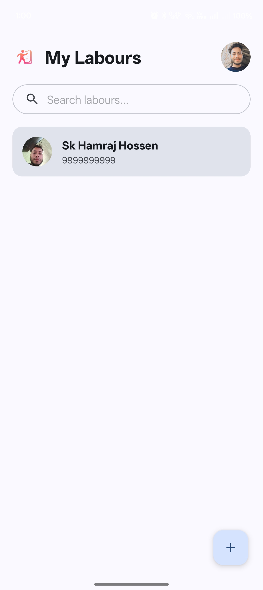
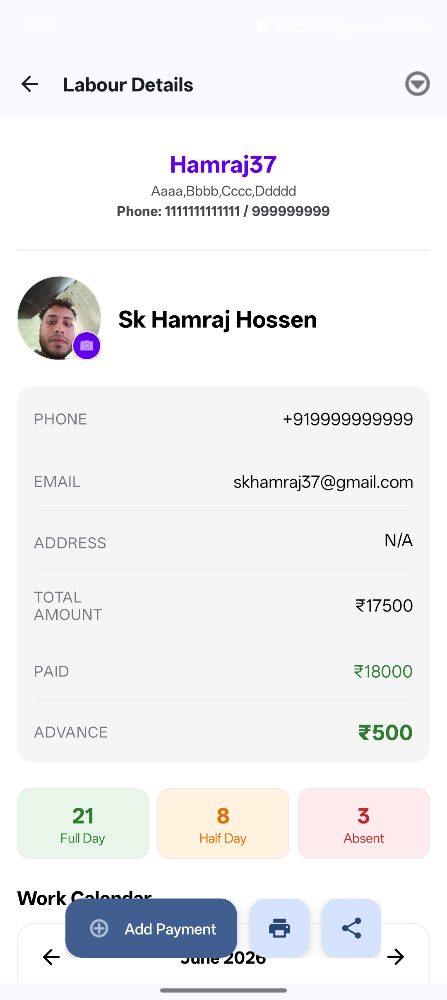
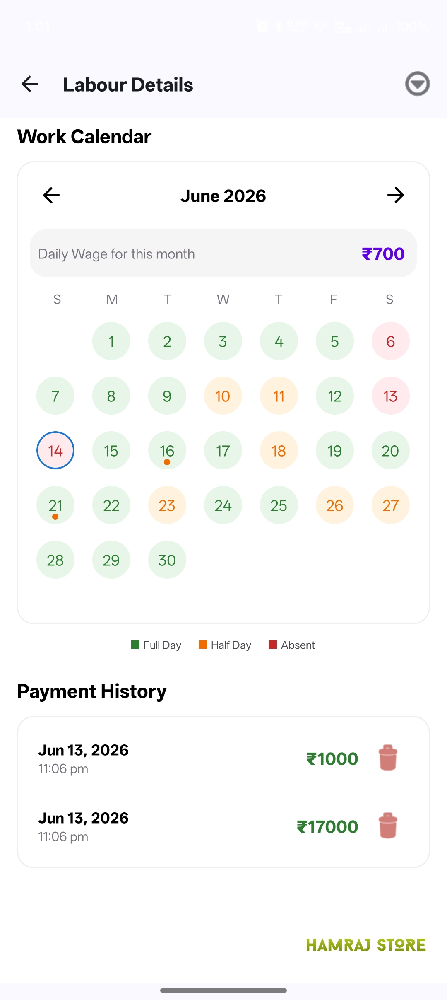

# My Labour

<p align="center">
  
</p>

**My Labour** is a powerful and intuitive Android application designed for contractors and site managers to effortlessly manage labour attendance, wages, and payments.

## 🚀 Features

- **Labour Management**: Easily add, edit, and maintain a directory of your workforce.
- **Advanced Attendance Tracking**:
  - Mark attendance with a single tap.
  - Supports multiple shifts (Full Day, Half Day, etc.).
  - Monthly calendar view for a quick overview.
- **Automated Wage Calculation**:
  - Automatically calculates monthly earnings based on attendance and daily wage.
  - Handles advances and previous month dues/balances.
- **Payment History**:
  - Track every payment made to labourers with timestamps.
  - Detailed payment history log.
- **User Profile Customization**:
  - Personalize your profile with a custom name and profile photo.
- **Professional Reports**:
  - Generate clean PDF attendance reports.
  - **Light Theme Reports**: Ensures reports are always readable and professional.
  - Branding with your Company Name, Address, and Contact details.
  - Support for digital signature/stamp on reports.
- **Seamless Sharing**:
  - Share PDF reports directly via WhatsApp, Email, or other platforms.
- **Smart Notifications**:
  - Daily reminders to mark attendance.
  - Automatic background checks for application updates via GitHub.
- **Security & Privacy**:
  - Powered by Firebase for real-time data sync across devices.
  - Secure Google Authentication.
  - **Account Isolation**: Local data (Company info, signatures, profile) is isolated per user account for enhanced privacy.

## 📸 Screenshots

| Dashboard | Attendance | Reports |
| :---: | :---: | :---: |
|  |  |  |

> **Note**: Add your actual screenshot images to the `screenshots/` directory in the root of the project to display them here.

## 🛠 Tech Stack

- **Language**: Java
- **Database**: Firebase Realtime Database
- **Authentication**: Firebase Auth (Google Sign-In)
- **Background Tasks**: WorkManager
- **Image Loading**: Glide
- **PDF Generation**: Android PdfDocument API
- **UI Components**: Material Components for Android (Material 3)

## 📦 Installation

1. Clone the repository:
   ```bash
   git clone https://github.com/Hamraj37/My-Labour.git
   ```
2. Open the project in Android Studio.
3. Connect your Firebase project and add the `google-services.json` file to the `app` folder.
4. Build and run the app on your device or emulator.

---
Developed with ❤️ by **Hamraj37**.
